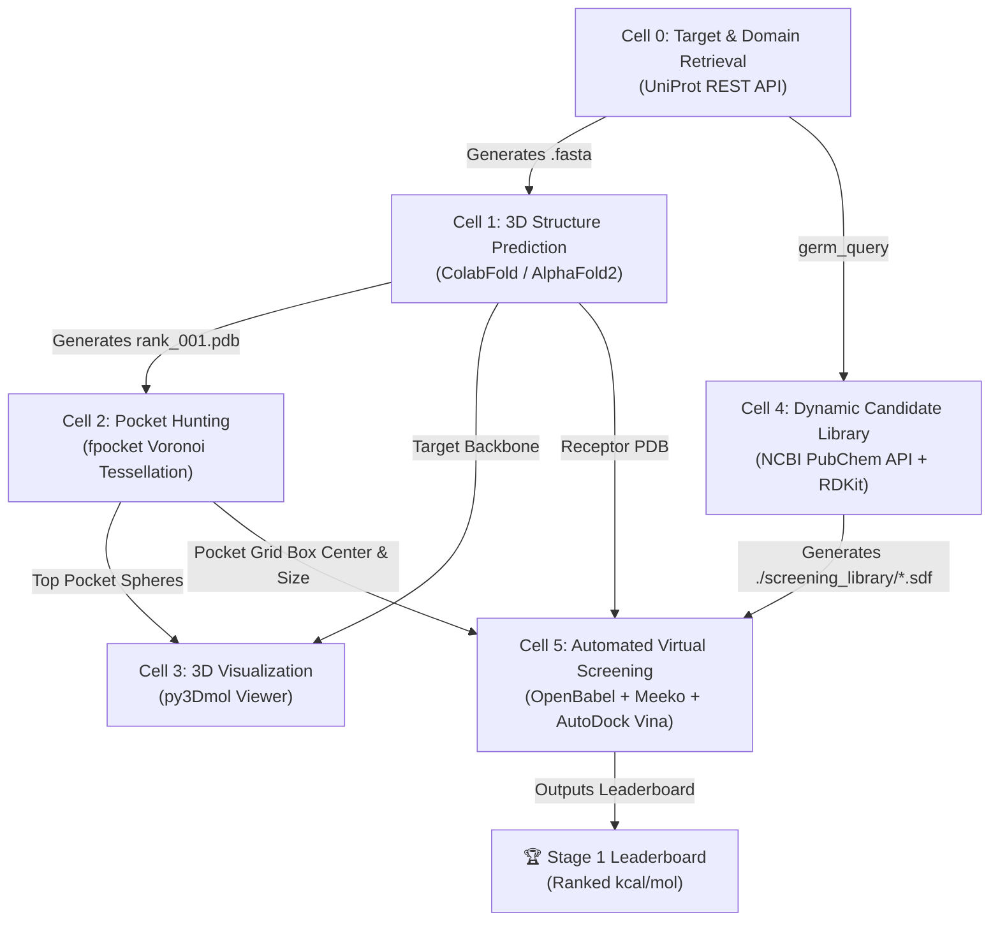

# Achilles: Conserved-Target Discovery Pipeline
## Stage 1 — Automated Target Discovery, Structural Folding & Virtual Screening Documentation

> [!NOTE]
> **Project Goal**: Build an automated end-to-end pipeline that discovers priority germ targets, predicts their 3D structures, identifies druggable binding pockets, dynamically retrieves small-molecule candidate libraries, and evaluates binding affinities via molecular docking.

---

## 🏗️ High-Level Pipeline Architecture



---

## 📑 Detailed Cell-by-Cell Breakdown & Output Interpretations

### **Cell 0: Target Sequence & Domain Retrieval**
* **Primary Objective**: Retrieve verified protein sequences and active domain boundaries for any pathogen specified by the user.
* **APIs & Tools**: UniProt REST API (`rest.uniprot.org`).
* **Input**: User-defined string `germ_query` (e.g., `"dengue NS3 protease"`, `"Acinetobacter baumannii OXA-23"`).
* **Console Output Explanation**:
  ```text
  Accession: P17763, Length: 3392 aa
  Auto-selected primary target domain [0]: Peptidase S7 (178 aa)
  ✓ Saved FASTA: P17763_Peptidase_S7.fasta
  ```
  * `Accession`: The unique UniProt database identifier (e.g., `P17763`).
  * `Length`: Total amino acids in full polyprotein sequence.
  * `Auto-selected primary target domain [0]`: Isolate catalytic core (178 aa) rather than the entire 3,392 aa polyprotein, saving compute time.

---

### **Cell 1: 3D Protein Structure Prediction**
* **Primary Objective**: Predict high-resolution 3D atomic coordinates of the target protein sequence.
* **APIs & Tools**: ColabFold (`colabfold.batch`), MMseqs2 (MSA generation), AlphaFold2-PTM.
* **Input**: FASTA file generated in Cell 0 (`fasta_file`).
* **Console Output Explanation**:
  ```text
  Folding target: P17763 (178 aa)...
  ✓ Structure predicted: ./results/P17763_Peptidase_S7_unrelaxed_rank_001_alphafold2_ptm_model_5_seed_000.pdb
  ```
  * `rank_001`: Indicates AlphaFold's highest-confidence 3D structural model based on average pLDDT confidence score.
  * `.pdb`: Protein Data Bank file format containing 3D Cartesian coordinates $(x,y,z)$ for every atom in the protein backbone and side chains.

---

### **Cell 2: Binding Pocket Detection**
* **Primary Objective**: Identify druggable surface cavities and catalytic pockets on the predicted protein.
* **APIs & Tools**: `fpocket` (Alpha Sphere / Voronoi Tessellation algorithm).
* **Input**: Top predicted PDB file from Cell 1 (`pdb_file`).
* **Console Output Explanation**:
  ```text
  ✓ Found 11 pockets.
  ✓ Top pocket selected: /content/results/.../pockets/pocket1_atm.pdb
  ```
  * `pocket1_atm.pdb`: Numerical sorting ensures `pocket1` (highest druggability score) is selected rather than alphabetical sorting picking `pocket10`.

---

### **Cell 3: Interactive 3D Visualization**
* **Primary Objective**: Visually inspect the spatial overlap between the protein backbone and the top binding pocket.
* **APIs & Tools**: `py3Dmol` (WebGL-rendered 3D viewport).
* **Visual Styling**:
  * **Protein Backbone**: Rendered as a light grey cartoon ribbon.
  * **Binding Pocket**: Rendered as semi-transparent red alpha-spheres filling the cavity.

---

### **Cell 4: Dynamic Small-Molecule Candidate Retrieval**
* **Primary Objective**: Fetch candidate inhibitor compounds dynamically from public chemical databases without hardcoding.
* **APIs & Tools**: NCBI PubChem E-Utilities (`esearch`), PubChem PUG-REST, RDKit (ETKDG algorithm & MMFF/UFF force fields).
* **Console Output Explanation**:
  ```text
  Querying PubChem database for compounds targeting: 'dengue NS3 protease'...
  Retrieved PubChem CIDs: ['176515286', '172676999', '172009741', '171391880', '171391769']
    ✓ Prepared 3D Molecule: Btbhb (CID: 176515286)
    ✓ Prepared 3D Molecule: Antiviral_agent_66 (CID: 172676999)
  ✓ Virtual screening library ready with 5 molecules in './screening_library/'
  ```
  * `CIDs`: Live PubChem Compound Identifiers retrieved for the target.
  * `Prepared 3D Molecule`: Converts 2D SMILES string into an energy-minimized 3D chemical conformer (`.sdf`).

---

### **Cell 5: Automated Virtual Screening & Minute Output Details**
* **Primary Objective**: Dock all candidate molecules into the identified binding pocket and score binding tightness.
* **APIs & Tools**: OpenBabel (`obabel`), Meeko (`MoleculePreparation`), AutoDock Vina, Pandas.

#### **Minute Details of Cell 5 Output**:

```text
Receptor structure: /content/results/P17763_Peptidase_S7_unrelaxed_rank_001...pdb
Binding pocket:     /content/results/.../pockets/pocket1_atm.pdb
Screening library:  5 molecules

Grid Center: X=6.38, Y=9.66, Z=-20.38
Grid Size:   X=13.31, Y=14.98, Z=20.07

Running virtual screening calculations...
--------------------------------------------------
  ✓ Antiviral_agent_53: -4.24 kcal/mol
  ✓ Antiviral_agent_54: -3.99 kcal/mol
```

#### **1. Grid Center Coordinates ($X, Y, Z$)**:
* **Meaning**: The exact 3D spatial coordinate $(X=6.38, Y=9.66, Z=-20.38)$ in 3D space corresponding to the geometric centroid of `pocket1_atm.pdb`.
* **Mathematical Formula**:
  $$\text{Center} = \left(\frac{1}{N}\sum_{i=1}^N x_i, \; \frac{1}{N}\sum_{i=1}^N y_i, \; \frac{1}{N}\sum_{i=1}^N z_i\right)$$

#### **2. Grid Size Dimensions ($X, Y, Z$) in Ångströms ($\text{Å}$)**:
* **Meaning**: The width ($13.31\text{ Å}$), height ($14.98\text{ Å}$), and depth ($20.07\text{ Å}$) of the 3D search box bounding the pocket cavity ($1\text{ Å} = 10^{-10}\text{ meters}$).
* **Padding Logic**: Calculated as $(\text{max\_coord} - \text{min\_coord}) + 8.0\text{ Å}$ to allow full rotational freedom for candidate molecules.

#### **3. Deprecation Warnings (Harmless Messages)**:
* `DeprecationWarning: MoleculePreparation.write_pdbqt_string() is deprecated...`
* **Interpretation**: Informational warning from `Meeko v0.5` notifying developers of API updates. It does **not** stop or affect Vina calculation accuracy.

#### **4. Negative Binding Affinity ($\text{kcal/mol}$)**:
* **Why it is negative**: In thermodynamics, binding free energy change ($\Delta G$) determines reaction spontaneity:
  $$\Delta G = \Delta H - T\Delta S = -RT \ln(K_d)$$
* **Key Rule**: **Negative values mean the binding is thermodynamically spontaneous and favorable.**
* **Comparison Guide**:

| Affinity ($\text{kcal/mol}$) | Interpretation | Binding Strength |
|---|---|---|
| **$>-4.0$** | Weak / Non-specific binding | Low potential |
| **$-4.0 \text{ to } -6.0$** | Moderate binding ($\mu\text{M}$ range) | Hit candidate |
| **$-6.0 \text{ to } -8.5$** | Strong binding ($\text{nM}$ range) | Lead candidate |
| **$<-8.5$** | Extremely high affinity binding | Top-tier therapeutic candidate |

---

## 🏆 Final Stage 1 Output Example

```text
==================================================
 STAGE 1 DOCKING LEADERBOARD (DENGUE NS3 PROTEASE)
==================================================
              Molecule  Affinity (kcal/mol)    Status
0   Antiviral_agent_53                -4.24   Success
1   Antiviral_agent_54                -3.99   Success
2   Antiviral_agent_66                -3.85   Success
3                Btbhb                -3.71   Success
4   Antiviral_agent_57                -3.42   Success
```
* **Conclusion**: `Antiviral_agent_53` yields the lowest (most negative) binding free energy ($-4.24\text{ kcal/mol}$), making it the top candidate to carry forward into **Stage 2 (Mutation Testing)**.
