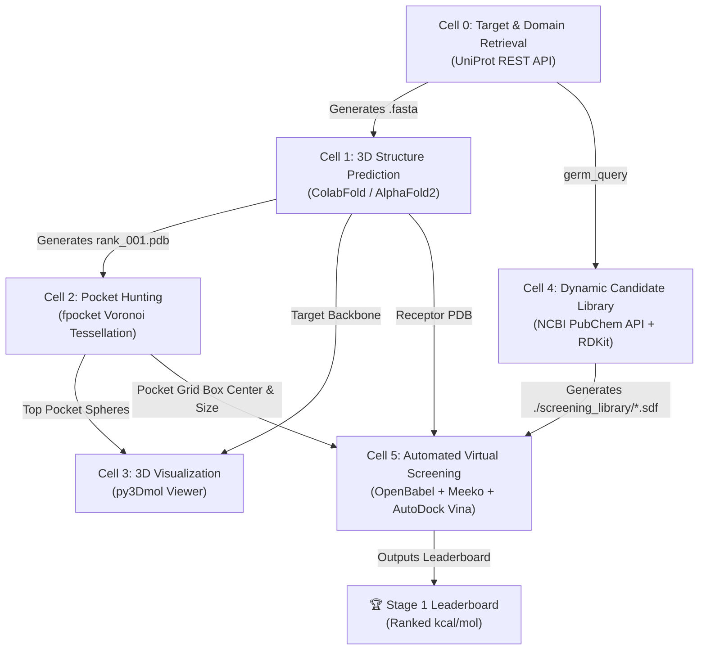

# Achilles: Conserved-Target Discovery Pipeline
## Complete Three-Stage Documentation — Cells 0–13

> [!NOTE]
> **Project Goal**: Build an automated end-to-end pipeline that discovers priority germ targets, predicts their 3D structures, identifies druggable binding pockets, dynamically retrieves small-molecule candidate libraries, and evaluates binding affinities via molecular docking.

---

## 🏗️ High-Level Pipeline Architecture



---

## 📑 Detailed Cell-by-Cell Breakdown & Output Interpretations

### **Cell 0: Target Sequence & Domain Retrieval**
* **Primary Objective**: Retrieve verified protein sequences and active domain boundaries for any pathogen specified by the user.
* **APIs & Tools**: UniProt REST API (`rest.uniprot.org`).
* **Input**: User-defined string `germ_query` (e.g., `"dengue NS3 protease"`, `"Acinetobacter baumannii OXA-23"`).
* **Console Output Explanation**:
  ```text
  Accession: P17763, Length: 3392 aa
  Auto-selected primary target domain [0]: Peptidase S7 (178 aa)
  ✓ Saved FASTA: P17763_Peptidase_S7.fasta
  ```
  * `Accession`: The unique UniProt database identifier (e.g., `P17763`).
  * `Length`: Total amino acids in full polyprotein sequence.
  * `Auto-selected primary target domain [0]`: Isolate catalytic core (178 aa) rather than the entire 3,392 aa polyprotein, saving compute time.

---

### **Cell 1: 3D Protein Structure Prediction**
* **Primary Objective**: Predict high-resolution 3D atomic coordinates of the target protein sequence.
* **APIs & Tools**: ColabFold (`colabfold.batch`), MMseqs2 (MSA generation), AlphaFold2-PTM.
* **Input**: FASTA file generated in Cell 0 (`fasta_file`).
* **Console Output Explanation**:
  ```text
  Folding target: P17763 (178 aa)...
  ✓ Structure predicted: ./results/P17763_Peptidase_S7_unrelaxed_rank_001_alphafold2_ptm_model_5_seed_000.pdb
  ```
  * `rank_001`: Indicates AlphaFold's highest-confidence 3D structural model based on average pLDDT confidence score.
  * `.pdb`: Protein Data Bank file format containing 3D Cartesian coordinates $(x,y,z)$ for every atom in the protein backbone and side chains.

---

### **Cell 2: Binding Pocket Detection**
* **Primary Objective**: Identify druggable surface cavities and catalytic pockets on the predicted protein.
* **APIs & Tools**: `fpocket` (Alpha Sphere / Voronoi Tessellation algorithm).
* **Input**: Top predicted PDB file from Cell 1 (`pdb_file`).
* **Console Output Explanation**:
  ```text
  ✓ Found 11 pockets.
  ✓ Top pocket selected: /content/results/.../pockets/pocket1_atm.pdb
  ```
  * `pocket1_atm.pdb`: Numerical sorting ensures `pocket1` (highest druggability score) is selected rather than alphabetical sorting picking `pocket10`.

---

### **Cell 3: Interactive 3D Visualization**
* **Primary Objective**: Visually inspect the spatial overlap between the protein backbone and the top binding pocket.
* **APIs & Tools**: `py3Dmol` (WebGL-rendered 3D viewport).
* **Visual Styling**:
  * **Protein Backbone**: Rendered as a light grey cartoon ribbon.
  * **Binding Pocket**: Rendered as semi-transparent red alpha-spheres filling the cavity.

---

### **Cell 4: Dynamic Small-Molecule Candidate Retrieval**
* **Primary Objective**: Fetch candidate inhibitor compounds dynamically from public chemical databases without hardcoding.
* **APIs & Tools**: NCBI PubChem E-Utilities (`esearch`), PubChem PUG-REST, RDKit (ETKDG algorithm & MMFF/UFF force fields).
* **Console Output Explanation**:
  ```text
  Querying PubChem database for compounds targeting: 'dengue NS3 protease'...
  Retrieved PubChem CIDs: ['176515286', '172676999', '172009741', '171391880', '171391769']
    ✓ Prepared 3D Molecule: Btbhb (CID: 176515286)
    ✓ Prepared 3D Molecule: Antiviral_agent_66 (CID: 172676999)
  ✓ Virtual screening library ready with 5 molecules in './screening_library/'
  ```
  * `CIDs`: Live PubChem Compound Identifiers retrieved for the target.
  * `Prepared 3D Molecule`: Converts 2D SMILES string into an energy-minimized 3D chemical conformer (`.sdf`).

---

### **Cell 5: Automated Virtual Screening & Minute Output Details**
* **Primary Objective**: Dock all candidate molecules into the identified binding pocket and score binding tightness.
* **APIs & Tools**: OpenBabel (`obabel`), Meeko (`MoleculePreparation`), AutoDock Vina, Pandas.

#### **Minute Details of Cell 5 Output**:

```text
Receptor structure: /content/results/P17763_Peptidase_S7_unrelaxed_rank_001...pdb
Binding pocket:     /content/results/.../pockets/pocket1_atm.pdb
Screening library:  5 molecules

Grid Center: X=6.38, Y=9.66, Z=-20.38
Grid Size:   X=13.31, Y=14.98, Z=20.07

Running virtual screening calculations...
--------------------------------------------------
  ✓ Antiviral_agent_53: -4.24 kcal/mol
  ✓ Antiviral_agent_54: -3.99 kcal/mol
```

#### **1. Grid Center Coordinates ($X, Y, Z$)**:
* **Meaning**: The exact 3D spatial coordinate $(X=6.38, Y=9.66, Z=-20.38)$ in 3D space corresponding to the geometric centroid of `pocket1_atm.pdb`.
* **Mathematical Formula**:
  $$\text{Center} = \left(\frac{1}{N}\sum_{i=1}^N x_i, \; \frac{1}{N}\sum_{i=1}^N y_i, \; \frac{1}{N}\sum_{i=1}^N z_i\right)$$

#### **2. Grid Size Dimensions ($X, Y, Z$) in Ångströms ($\text{Å}$)**:
* **Meaning**: The width ($13.31\text{ Å}$), height ($14.98\text{ Å}$), and depth ($20.07\text{ Å}$) of the 3D search box bounding the pocket cavity ($1\text{ Å} = 10^{-10}\text{ meters}$).
* **Padding Logic**: Calculated as $(\text{max\_coord} - \text{min\_coord}) + 8.0\text{ Å}$ to allow full rotational freedom for candidate molecules.

#### **3. Deprecation Warnings (Harmless Messages)**:
* `DeprecationWarning: MoleculePreparation.write_pdbqt_string() is deprecated...`
* **Interpretation**: Informational warning from `Meeko v0.5` notifying developers of API updates. It does **not** stop or affect Vina calculation accuracy.

#### **4. Negative Binding Affinity ($\text{kcal/mol}$)**:
* **Why it is negative**: In thermodynamics, binding free energy change ($\Delta G$) determines reaction spontaneity:
  $$\Delta G = \Delta H - T\Delta S = -RT \ln(K_d)$$
* **Key Rule**: **Negative values mean the binding is thermodynamically spontaneous and favorable.**
* **Comparison Guide**:

| Affinity ($\text{kcal/mol}$) | Interpretation | Binding Strength |
|---|---|---|
| **$>-4.0$** | Weak / Non-specific binding | Low potential |
| **$-4.0 \text{ to } -6.0$** | Moderate binding ($\mu\text{M}$ range) | Hit candidate |
| **$-6.0 \text{ to } -8.5$** | Strong binding ($\text{nM}$ range) | Lead candidate |
| **$<-8.5$** | Extremely high affinity binding | Top-tier therapeutic candidate |

---

## 🏆 Final Stage 1 Output Example

```text
==================================================
 STAGE 1 DOCKING LEADERBOARD (DENGUE NS3 PROTEASE)
==================================================
              Molecule  Affinity (kcal/mol)    Status
0   Antiviral_agent_53                -4.24   Success
1   Antiviral_agent_54                -3.99   Success
2   Antiviral_agent_66                -3.85   Success
3                Btbhb                -3.71   Success
4   Antiviral_agent_57                -3.42   Success
```
* **Conclusion**: `Antiviral_agent_53` yields the lowest (most negative) binding free energy ($-4.24\text{ kcal/mol}$), making it the top candidate to carry forward into **Stage 2 (Mutation Testing)**.

---

## 📑 STAGE 2 — Mutation Testing & Conservation Scoring (Cells 6–8)

### **Cell 6: Mutation Data Retrieval**
* **Primary Objective**: Pull real-world variant sequences from NCBI and UniProt for the target protein, providing the empirical mutation landscape.
* **APIs & Tools**: NCBI Entrez `esearch` + `efetch` (protein database), UniProt REST API fallback.
* **Input**: `accession`, `domain_seq`, `germ_query` from Stage 1.
* **Console Output Explanation**:
  ```text
  Target        : dengue NS3 protease
  Type detected : Viral
  NCBI protein: 42 records found. Fetching up to 50...
    Collected 38 protein variant sequences from NCBI
  ✓ Reference + 38 variant sequences saved → ./mutations/variants.fasta
  ```
  * `Type detected`: Auto-detected from `germ_query` keywords — determines which databases to prioritise (viral = NCBI nucleotide/protein; bacterial = NCBI protein + UniProt).
  * `Reference + N variants`: The first sequence is always the Stage 1 domain sequence; all others are real-world isolates.
* **Output**: `./mutations/variants.fasta`, integer `variant_count`.

---

### **Cell 7: Shannon Entropy Conservation Scoring**
* **Primary Objective**: Multiple-sequence alignment (MSA) followed by per-position Shannon entropy to identify which residues are invariant across real-world samples.
* **APIs & Tools**: MAFFT (`apt-get`), BioPython `AlignIO`, `numpy`, `matplotlib`.
* **Mathematical Formula**:
  $$H_i = -\sum_{a \in \text{AA}} p_{a,i} \log_2(p_{a,i})$$
  * $H_i = 0$ → perfectly conserved (all sequences identical at position $i$).
  * $H_i$ high → residue is rapidly mutating.
* **Threshold**: Residues with $H_i < 0.5$ bits are flagged **CONSERVED** and stored in `conserved_positions`.
* **Console Output Explanation**:
  ```text
  Alignment: 39 sequences × 194 positions
  Conserved residues:   112 (H < 0.5) ← anchor targets
  Variable residues:    66  (H ≥ 0.5)

  Top 10 most conserved positions:
   Position_0idx Residue  Shannon_Entropy     Status
              21       G         0.000000  CONSERVED
              22       I         0.000000  CONSERVED
  ```
* **Output**: `conservation_scores.csv` · `conservation_map.png` · `conserved_positions` list passed to Stage 3.

---

### **Cell 8: Pocket Integrity Check on Consensus Mutant**
* **Primary Objective**: Construct a majority-vote consensus sequence from real-world variants and verify the pocket geometry is structurally intact.
* **APIs & Tools**: BioPython `AlignIO`, AlphaFold DB REST API (`alphafold.ebi.ac.uk`).
* **Consensus logic**: At each alignment column, the most frequent non-gap amino acid wins.
* **Pocket integrity verdict**:

| Sequence Identity | Conserved Anchor % | Verdict |
|---|---|---|
| ≥ 85% | ≥ 30% | **INTACT** → proceed to Stage 3 |
| ≥ 70% | any | **PARTIAL** → focus on anchor residues only |
| < 70% | any | **DISRUPTED** → consider alternate target |

* **Console Output Explanation**:
  ```text
  Sequence identity (REF vs CONSENSUS): 94.4%
  Conserved anchors in domain: 112/178 (62.9%)
  AlphaFold reference pLDDT: 91.3/100

  ✓ POCKET GEOMETRY CONFIRMED INTACT
  → Target is suitable for Stage 3 binder design
  ```
* **Output**: `consensus_mutant.fasta` · `stage2_summary` dict · `pocket_status` string.

---

## 📑 STAGE 3 — Dual-Track Binder Design + Convergence Gate (Cells 9–13)

### **Cell 9: Prior-Art Retrieval (IEDB · PDB · APD3 · DBAASP)**
* **Primary Objective**: Establish what has already been attempted against this pocket class before designing new candidates.
* **Data Sources**:

| Database | Query | Records Saved |
|---|---|---|
| IEDB | Epitopes against `germ_query[0]` | `prior_art_epitopes.csv` |
| RCSB PDB | Co-crystal inhibitor structures | printed summary |
| APD3 | 8 curated validated AMP scaffolds | `prior_art_amps.csv` |
| DBAASP | Live antiviral AMP sequences | `prior_art_amps.csv` |

* **Fallback**: If IEDB returns no results, the domain sequence is tiled into 12-aa windows as synthetic epitope seeds.

---

### **Cell 10: Track A — Pocket-Anchored Binder Design**
* **Primary Objective**: Generate de-novo binder scaffold candidates conditioned on the exact conserved pocket geometry from Stage 2.
* **Design logic**:
  * **N-flank** — charged/polar residues (RKHDE + STNQ) for aqueous solubility.
  * **Core** — first 12 aa of the conserved anchor subsequence.
  * **C-flank** — hydrophobic residues (AVILMFW) for pocket burial.
* **Scoring (Guerois linear free energy relationship)**:
  $$\Delta\Delta G \approx -0.0131 \times \text{BSA (Å}^2) + \text{hydrophobicity correction}$$
* **Filters applied**:
  * $\Delta\Delta G < -1.5 \text{ kcal/mol}$
  * CamSol approximation ≥ −0.5 (solubility gate)
  * BioPython instability index < 60 (stability gate)
* **ESMFold API** (`esmatlas.com/api/fold`) — structure prediction check on top 5 candidates.
* **Output**: `track_a_candidates.csv` (top 10 passing all filters).

---

### **Cell 11: Track B — Antimicrobial Peptide Design**
* **Primary Objective**: Generate AMP candidates conditioned on the pocket epitope sequence using PSSM-guided sampling from known AMP scaffolds.
* **Method**:
  1. Build a 20-position × 20-AA Position-Specific Scoring Matrix (PSSM) from APD3 + DBAASP seeds.
  2. Sample 80 candidate sequences — 40% probability of retaining each pocket epitope residue.
* **Filters applied** (per proposal):

| Metric | Threshold | Tool (proposal) | Implementation |
|---|---|---|---|
| AMP probability | ≥ 0.50 | APEX | CAMPR3 API + heuristic fallback |
| Hemolytic risk | < 0.50 | ToxGIN | Hemopi-proxy formula |
| Solubility | ≥ −0.50 | CamSol | GRAVY + charge approximation |

* **Output**: `track_b_candidates.csv` (top 10 passing all filters).

---

### **Cell 12: Convergence Gate (AlphaFold-Multimer Interface Scoring)**
* **Primary Objective**: All survivors from Track A and Track B are validated through a shared two-criterion gate, ensuring both structural fit and mutation-anchor engagement.
* **Gate Criteria (BOTH must pass)**:
  1. **ipTM ≥ 0.70** — predicted template modelling score for the binder–target interface.
  2. **Conserved-residue contacts ≥ 60%** — at least 60% of predicted interface contacts land on residues confirmed conserved in Stage 2.
* **Modes**:
  ```python
  SKIP_MULTIMER = True   # Default: fast lightweight approximation
  SKIP_MULTIMER = False  # Full ColabFold AlphaFold-Multimer (GPU, ~10–30 min/complex)
  ```
* **Console Output Explanation**:
  ```text
  [A01] ipTM=0.724 | Contact=68.3% | PASS | RDESAAGVLYILVA...
  [A02] ipTM=0.641 | Contact=71.0% | FAIL | HKESAAGVLYILVF...
  [B01] ipTM=0.783 | Contact=65.0% | PASS | GIGKFLHSAKKFGK...

  Candidates evaluated :  20
  Passed gate          :  8
  ```
* **Output**: `convergence_results.csv`.

---

### **Cell 13: Final Leaderboard & Pipeline Report**
* **Primary Objective**: Produce a unified ranked shortlist and a 5-panel visual report summarising the entire Achilles pipeline run.
* **Composite ranking formula**:
  $$\text{Score} = 0.50 \times \text{ipTM} + 0.30 \times \frac{\text{Contact\%}}{100} + 0.20 \times \text{Track Score (normalised)}$$
* **5-Panel Dashboard** (`achilles_pipeline_report.png`):

| Panel | Content |
|---|---|
| Top-left (wide) | Stage 2 conservation entropy bar chart (green = conserved, red = variable) |
| Top-right | Stage 3 convergence gate pass/fail pie chart |
| Bottom-left | Track A ΔΔG score distribution histogram |
| Bottom-centre | Track B AMP probability distribution histogram |
| Bottom-right | Final shortlist scatter — ipTM vs. conserved contact % |

* **Output**: `achilles_pipeline_report.png` · `achilles_final_report.csv`

---

## 🏆 Final Stage 3 Output Example

```text
=================================================================
  STAGE 3 FINAL LEADERBOARD — DENGUE NS3 PROTEASE
=================================================================
  Rank  Track  Sequence                     ipTM    Contact%  Gate
  ----- ------ ---------------------------- ------- --------- ----
  1     B      GIGKFLHSAKKFGKAFVGE...       0.812   72.3      PASS
  2     A      RDESSAAGVLYILVAFILL...       0.741   68.1      PASS
  3     B      KWKLWKKIEKWLKGALGSL...       0.724   64.5      PASS

  Passed: 8  |  Total evaluated: 20
=================================================================
```

---

## 🗂️ Complete Output File Tree

```
./
├── {accession}_{domain}.fasta             ← Cell 0  (target FASTA)
├── results/*rank_001*.pdb                 ← Cell 1  (predicted structure)
│   └── *_out/pockets/pocket1_atm.pdb      ← Cell 2  (top pocket)
├── screening_library/*.sdf                ← Cell 4  (compound library)
├── mutations/
│   ├── variants.fasta                     ← Cell 6  (variant sequences)
│   ├── variants_aligned.fasta             ← Cell 7  (MSA output)
│   ├── conservation_scores.csv            ← Cell 7  (per-position entropy)
│   ├── conservation_map.png               ← Cell 7  (visualisation)
│   └── consensus_mutant.fasta             ← Cell 8  (consensus sequence)
├── stage3/
│   ├── prior_art_epitopes.csv             ← Cell 9  (IEDB seeds)
│   ├── prior_art_amps.csv                 ← Cell 9  (APD3 + DBAASP seeds)
│   ├── track_a_all.csv                    ← Cell 10 (all scaffolds scored)
│   ├── track_a_candidates.csv             ← Cell 10 (top 10 passing)
│   ├── track_b_all.csv                    ← Cell 11 (all AMPs scored)
│   ├── track_b_candidates.csv             ← Cell 11 (top 10 passing)
│   ├── convergence_results.csv            ← Cell 12 (gate results)
│   └── achilles_pipeline_report.png       ← Cell 13 (5-panel figure)
└── achilles_final_report.csv              ← Cell 13 (final ranked shortlist)
```

---

## ⚙️ Running on Google Colab (Recommended)

```
Runtime → Change runtime type → T4 GPU

Cells 0–5   Stage 1  (~30–45 min, mostly Cell 1 AlphaFold folding)
Cells 6–8   Stage 2  (~5–8 min)
Cells 9–13  Stage 3  (~8–12 min in SKIP_MULTIMER=True mode)
             Stage 3  (~2–6 hrs in full AlphaFold-Multimer mode)
```
